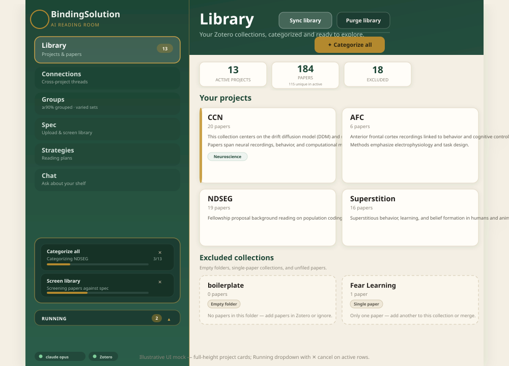
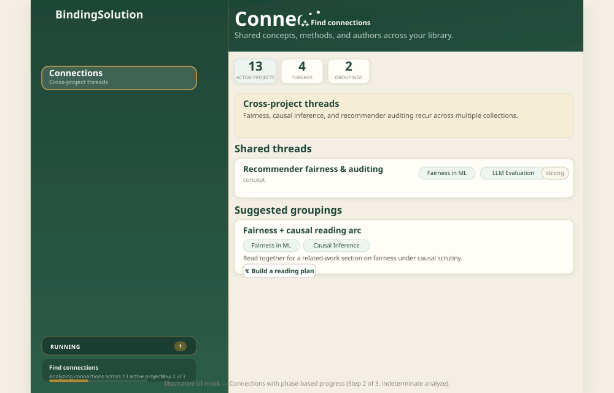
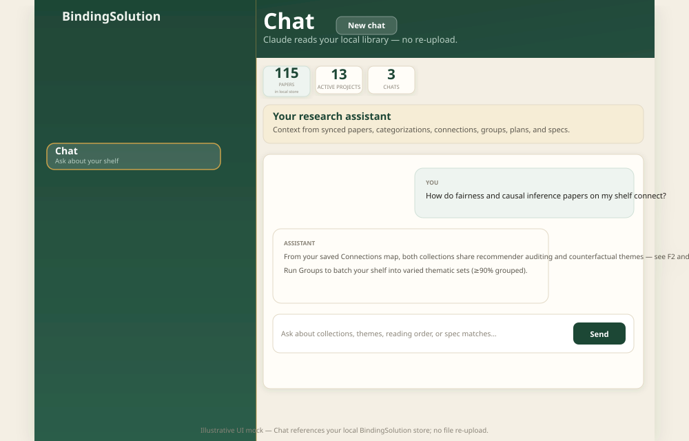

<div align="center">


**Point it at your Zotero library and it makes sense of it.**

*Categorize collections, find cross-project threads, group papers without duplication, plan what to read, and match papers to a project spec — locally, with Claude.*

</div>

---

## Quick start

```bash
git clone https://github.com/kahinimehta/bindingsolution.git
cd bindingsolution
make setup && make run    # → http://127.0.0.1:8765
```

Add `ANTHROPIC_API_KEY`, `ZOTERO_LIBRARY_ID`, and `ZOTERO_API_KEY` to the gitignored `.env` from setup — see [docs/CONFIGURATION.md](docs/CONFIGURATION.md).

**No keys?** `make run` → **Load demo library** (heuristic “demo AI”, full UI).

## Features

Six sidebar views (Library → Connections → Groups → Spec → Strategies → Chat):

- **Library** — sync Zotero (web API or local Zotero 7) or load demo data; categorize collections; **Sync** / **Purge** in the hero toolbar
- **Connections** — shared threads and suggested project groupings across active collections
- **Groups** — cross-project paper sets (≥90% grouped, ≥10 papers per set, varied sizes), set summaries, drop suggestions
- **Spec** — upload a brief, screen your library (incremental re-screen), discover papers on PubMed, build a plan from matches
- **Strategies** — ordered reading plans with schedule estimates
- **Chat** — ask about your synced shelf from local metadata only (no PDFs); compact can/cannot overview

**Running** — sidebar dropdown tracks background jobs; close the progress popup to keep working; cancel from **✕** on an active row (not the popup). Indeterminate progress for single-shot Claude steps.

## Assumptions

- **Local single-user tool** — server binds to `127.0.0.1`; library and analyses live in `./data/library.json` (gitignored).
- **Active collections** — only folders with **2+ papers** are analyzed; empty, single-paper, and unfiled collections are reference-only.
- **Metadata, not PDFs** — Claude sees titles, tags, and saved analyses from your local store, not re-uploaded full text.
- **Paper groups** — non-overlapping sets across projects; ≥90% of papers grouped when possible; balanced set sizes (not uniform chunks).
- **Reading schedules** — planning hints at ~12 pages/hour, 2 h/day medium pace ([detail](docs/USAGE.md#reading-time-assumptions)).
- **Display** — large-type layout for ultrawide / high-DPI monitors ([detail](docs/CONFIGURATION.md#display)).

After `git pull`, restart the server (`Ctrl+C`, then `make run`) so new routes load.

## Claude API usage

Live AI features bill **your** Anthropic account per token. Zotero sync, PubMed discovery, and re-opening saved results are free.

| Heavier | Lighter |
| --- | --- |
| **Find in library** — one call per active paper (first run) | Categorize one project, spec upload validation |
| **Re-screen library** — new papers only after sync | Connections, groups, reading plan, **Chat** message |

Try demo mode first; tidy thin Zotero folders; read the spec-screening confirmation before a large run; set a [spend limit](https://console.anthropic.com/settings/billing). Full detail: [docs/BILLING.md](docs/BILLING.md).

<p align="center">
  
</p>

<p align="center">
  
</p>

<p align="center">
  
</p>

<p align="center">
  
  <br /><br />
  
</p>

<p align="center">
  
</p>

<p align="center">
  
</p>

## Docs

[USAGE](docs/USAGE.md) · [CONFIGURATION](docs/CONFIGURATION.md) · [BILLING](docs/BILLING.md) · [ARCHITECTURE](docs/ARCHITECTURE.md) · `make test`

## License

MIT — [LICENSE](LICENSE).
