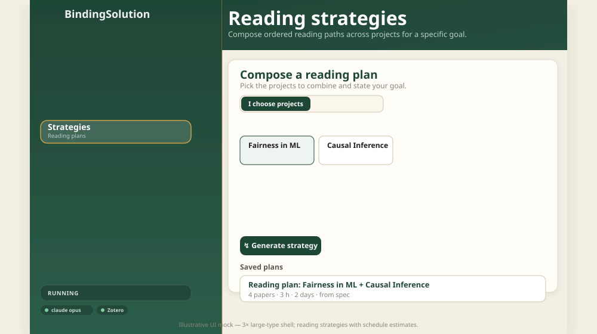
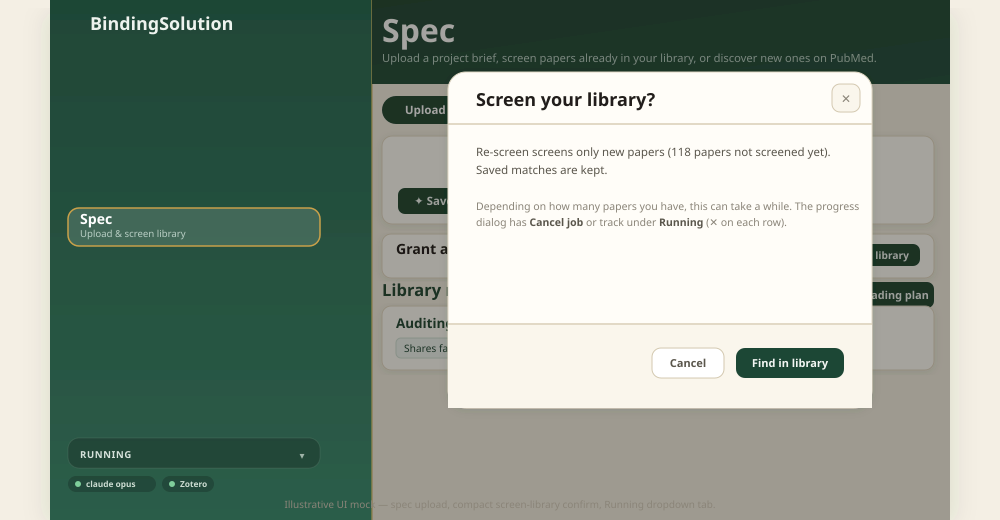

# Usage

Start the app with `make run` and open <http://127.0.0.1:8765>. The **sidebar**
has five views — use them in any order. On wide screens the whole interface
(sidebar + content) is **centered** as one panel. **Sync library** and
**Purge library** live in the **hero toolbar** (top right); status chips at the
bottom of the sidebar show whether Claude and Zotero are connected.

> **No keys?** Click **Load demo library** on the Library screen. You get a
> small synthetic library spanning four overlapping research areas so every
> feature is explorable. AI features run in heuristic "demo AI" mode (marked
> with a small badge) until you add a Claude key.

---

## 1. Sync your library

Click **Sync library** in the top toolbar (or **Load demo library** on the empty
state). Each Zotero **collection** becomes a **project**; nested collections
keep their full path as the name. Re-syncing refreshes papers while keeping
any categorization you've already generated.

**Active vs excluded:** only collections with **at least 2 papers** are active.
Empty folders, single-paper collections, and **Library (unfiled)** appear in a
separate **Excluded collections** section — visible for reference but left out
of categorization, connections, paper groups, reading plans, and spec screening. Add papers or
merge collections in Zotero, then re-sync.

**Purge library:** to wipe everything locally and start over, click **Purge
library** in the top toolbar (next to **Sync library**). This deletes synced projects,
categorizations, connections, paper groups, saved reading plans, and project specs from
`./data/library.json`. It does **not** change your Zotero library. Confirm in
the dialog, then sync again or load the demo library. The button is hidden when
the shelf is already empty.

## 2. 📂 Categorize projects — *Library*

Open the **Library** view. Click **✦ Categorize** on an active card (or
**Categorize all** in the top bar). For each project Claude returns:

- a **discipline** and a specific **topic label**
- a 2–3 sentence **summary**
- recurring **themes** and common **methods**
- **keywords** used to match it against other projects

Click any card to see its full paper list and categorization.

## 3. ⁂ Find connections — *Connections*

Open **Connections** and click **Find connections**. Claude reads across all
projects and surfaces:

- **Shared threads** — a concept, method, dataset, or author that links two or
  more projects, each with a strength (strong / moderate / weak)
- **Suggested groupings** — clusters of projects worth reading together, each
  with a *Build a reading plan* shortcut

Connections need at least two projects.

## 4. ◎ Group papers — *Groups*

Open **Groups** and click **◎ Group papers**. BindingSolution reads across all
active projects and proposes:

- **Optimal paper sets** — non-overlapping reading groups that may span multiple
  Zotero collections. Each paper appears in **at most one** set, so you are not
  asked to read the same work twice under different folders.
- **Suggested drops** — papers to remove or archive: duplicates filed in more
  than one collection, redundant surveys, weak fits, or entries that no longer
  match your shelf.

**Connections vs Groups:** *Connections* links **projects** (shared threads and
which collections to combine). *Groups* organizes **individual papers** without
duplication and tells you what to prune.

Demo mode uses deterministic heuristics (title deduping and tag clustering); with
a Claude key the same schema is filled by the model.

  

## 5. ↯ Plan your reading — *Strategies*

Open **Strategies**. Either:

- **I choose projects** — tick the projects to combine, or
- **Let the agent decide** — it uses the suggested combination (or your whole
  library)

Add a one-line **goal** (e.g. *"a related-work section linking fairness and
causal inference"*) and click **Generate strategy**. You get:

- an ordered **reading sequence** (foundational/methodological papers first),
  each step explained
- a **reading schedule** — estimated time per paper, total hours, and a
  day-by-day layout
- **synthesis prompts** to hold in mind as you read across the set

Plans are saved; open or delete them from the same screen. Plans built from a
spec show **from spec** in the list and a link back to the spec's **Library
matches** when you open them.

### Reading time assumptions

Estimates assume a **medium academic reading pace**:

| Assumption | Value |
| --- | --- |
| Reading speed | **~12 pages/hour** (~5 min/page) — careful read of dense PDFs |
| Default paper length | **9 pages** when Zotero has no page count (typical conference/journal article) |
| Longer papers | Surveys/reviews ~18 pages; theses/books ~35 pages; inferred from tags and abstract length when needed |
| Daily budget | **2 hours/day** of focused reading to spread steps across **Day 1**, **Day 2**, … |

These are planning hints, not deadlines. Skim faster or read deeper and your real time will differ. The schedule banner on each plan states the assumptions used.

  

## 6. ✦ Spec — upload, screen library, discover on PubMed

Open **Spec** in the sidebar. The view has two tabs with different jobs:

| Tab | What it does | Uses Claude? |
| --- | --- | --- |
| **Upload & manage** | Save a brief and **Find in library** (screen your synced Zotero shelf) | Yes — one call per active paper |
| **Suggested papers** | **Discover new papers** on PubMed that are *not* already in your library | No — PubMed eutils (free) |

### Upload & manage

1. Drop a **PDF, Word (.doc/.docx), Markdown, or text** file — or paste a grant
   aim, proposal, or one-paragraph project description.
2. Click **Save spec**. Irrelevant uploads (shopping lists, filler text, published
   papers, admin docs) are rejected with a short explanation of what to upload
   instead.
3. Click **Find in library** on a saved spec. A confirmation explains how many
   papers will be screened and that runtime scales with library size.
4. Scroll to **Library matches** on the same tab. Pick a spec, review core /
   supporting hits with **why it's relevant** notes, and click **↯ Build reading
   plan** to turn them into an ordered path in **Strategies**.

  

### Suggested papers (PubMed)

Switch to **Suggested papers** when you want *new* literature — papers you do
not already have in Zotero.

- Pick a spec from the dropdown.
- Click **✦ Discover new papers**. BindingSolution builds a PubMed query from your
  spec text and categorized project keywords, searches NCBI eutils, and filters
  out titles already in your synced library.
- You get **up to five** hits, ranked by keyword overlap with your spec. Each row
  links to PubMed, shows a **one-sentence summary** (from the abstract when
  available), and a short **why it's relevant** note. Papers below a relevance
  cutoff are dropped, so you may see fewer than five if the tail is weak.
- Re-run discovery after you update the spec or categorize more projects.

Demo mode (`MOCK_LLM=true`) uses deterministic mock PubMed hits so you can try
the flow offline.

  

---

## Tips

### Workflow

- Every analysis runs as a background job with a **live progress bar** — you
  can keep working while it runs. Confirmations and progress (spec screening,
  reading plans, connections, bulk categorization) open in the same centered
  dialog so the page does not jump or rescroll behind you.
- **Find in library** re-screens against the current shelf — each re-run calls
  Claude again for every active paper (see [BILLING.md](BILLING.md)). PubMed
  discovery is separate and does not use your Anthropic key.
- Saved categorizations, connections, plans, and spec results are **free to
  re-open**; you only pay when you trigger a new analysis.

### Using the Claude API wisely

Full detail: **[docs/BILLING.md](BILLING.md)**. Short version:

1. **Try demo mode first** — no key, or `MOCK_LLM=true`, to learn the UI.
2. **Categorize what you need** — avoid **Categorize all** on a huge shelf until
   you know the output is useful.
3. **Spec screening is the big one** — cost scales with paper count; read the
   confirmation dialog before you start.
4. **Do not repeat heavy jobs** — re-run connections, strategies, or spec
   screening only when your library or goals actually changed.
5. **Tidy Zotero** — active collections need 2+ papers; merge thin folders so
   you are not screening noise.
6. **Pick your model** — default `claude-opus-4-8` is strongest; a faster model
   in `ANTHROPIC_MODEL` can reduce cost for large libraries (restart required).
7. **Set a spend limit** in the [Anthropic Console](https://console.anthropic.com/settings/billing).
